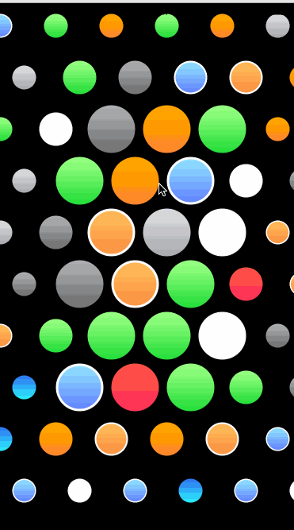

BRBubbles.Swift
=========

BRBubbles(https://github.com/azzoor/BRBubbles) Swift Implementation

Recreating the Watch main interface.

If you unhide the viewBarrier you can then see the view size that is adjusting the images.

Swift语言实现BRBubbles版本

Swift语言实现Apple Watch主界面圆形图标漂浮效果

##环境

- Xcode 6.1 编译通过

swift迷社区 http://www.swiftmi.com

